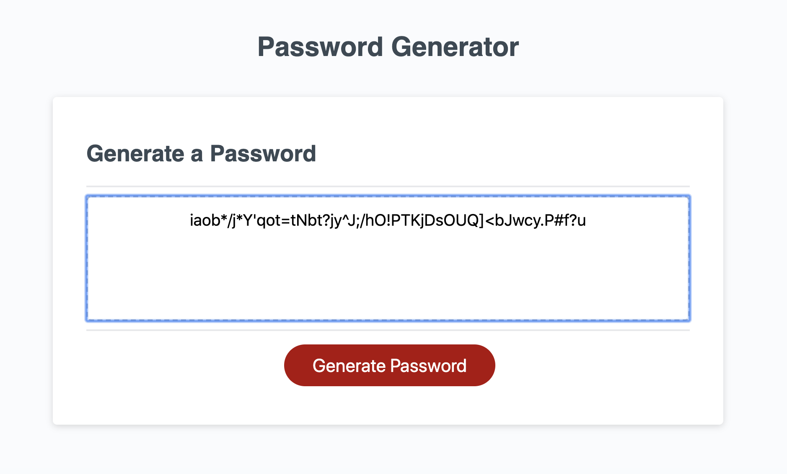

# 03 JavaScript: Password Generator

This application generates a random password based on user-selected criteria. 

------------------------------------

Users will select a password length between 8 and 128, then the following criteria:
* Numbers
* Uppercase letters
* Lowercase letters
* Special characters

Then, based upon the criteria selected a random password will be rendered in the window.

------------------------------------

GitHub link to generator page: (https://puppyburp.github.io/03-javascript-password-generator/)

------------------------------------

The following image demonstrates the application functionality:

